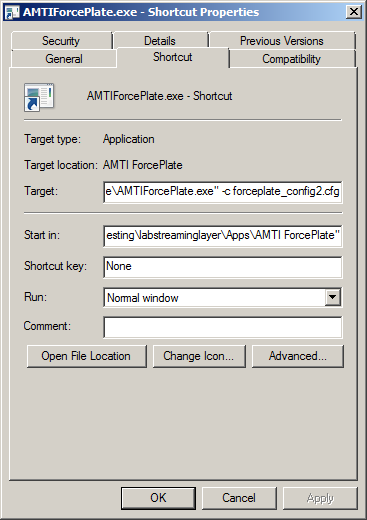

# Overview

This application should support LSL streaming from the majority of force plates manufactured by AMTI (http://amti.biz/) that rely on serial-port communication. Note that a serial-to-USB adapter can be used in place of a true serial port. The program produces 7 channels of output, including a 3-dimensional force vector, a 3-dimensional momentum vector, and a 0/1-valued trigger channel.

# Setup
Most force plates come with a calibration sheet (or CD) that contains a mapping between sensors and force/momentum vectors; this mapping is a matrix that is different for each unit, and consequently it needs to be entered into the configuration file before the force plate app can be used. Unless otherwise specified the file named `forceplate_config.cfg` is  loaded at startup, which looks as in the following example. The calibration matrix is found in the setting `calibration_matrix1`.

```
<?xml version="1.0" encoding="utf-8"?>
<settings>
    <comport>1</comport>
    <samplingrate>0</samplingrate>
    <calibration_matrix1>
                        [0.0088010,-0.0003439,-0.0002374,-0.0091382, 0.0002286,-0.0011453, 0.0087575,-0.0000330, 0.0001908,-0.0085257,-0.0003653,-0.0004479,
                         -0.0000572, 0.0089623, 0.0005131,-0.0003076, 0.0086073,-0.0000008,-0.0002277,-0.0084864,-0.0010120, 0.0004282,-0.0087719,-0.0007067,
                         -0.0016028,-0.0009292,-0.0885598, 0.0000639, 0.0000603,-0.0867306,-0.0003682, 0.0002382,-0.0868983,-0.0004845, 0.0002808,-0.0880958,
                          0.0000000, 0.0000000,-0.6305114, 0.0000000, 0.0000000,-0.6221169, 0.0000000, 0.0000000, 0.6244931, 0.0000000, 0.0000000, 0.6209047,
                          0.0000000, 0.0000000, 0.6524594, 0.0000000, 0.0000000,-0.6378316, 0.0000000, 0.0000000, 0.6425910, 0.0000000, 0.0000000,-0.6428833,
                         -0.0931016, 0.0958635, 0.0012947, 0.0966692,-0.0920663, 0.0012679, 0.0926413,-0.0907731, 0.0012704,-0.0901891, 0.0938268, 0.0012879]
    </calibration_matrix1>
</settings>
```

A second force plate can be configured (for systems that support two multiplexed force plates) as calibration\_matrix2; this has, however, not yet been tested.


# Usage

To use: simply connect the forceplate, choose your samplingrate and hit 'Link'. When relinking, the connection will sometimes fail. Try again, and if the problem persists, close the app, powercycle the forceplate (unplug it), and restart the app.


  * Make sure that the force plate is powered and plugged correctly into the AMTI serial port adapter. Some adapters support two plates and have a switch to select between A and A+B which can flip easily during transport. The adapter will **not** transmit any data if it is set to A+B while only one plate is plugged in.

  * Start the AMTIForcePlate app. You should see a window like the following:
>

  * Make sure that you have the right COM port (you should see this in your Control Panel / System / Device Manager / Ports / COMx system setting. We have had trouble using any other sampling rate than 50Hz with our plate + USB adapter combination, so a reasonable first choice is 50Hz. Let us know if you can use the other sampling rates successfully (there are various settings that might be tried for this purpose in the system's COM port settings).

  * Click the "Link" button. If all goes well you should now have a stream on your lab network that has type "Force" and its name is "AMTIForcePlate". When you click on Link the force plate automatically recalibrates itself to "zero" output, so you should link it before it is being loaded. Note that you cannot close the app while it is linked.

  * For subsequent uses you can save the desired port number and sampling rate by hand in the configuration file or save the new settings that you have applied in the GUI via File / Save Configuration. If the app is frequently used with different settings you might can also make a shortcut on the desktop that points to the app and appends to the Target field the snippet `-c name_of_config.cfg`, as in the following screen shot:
>
